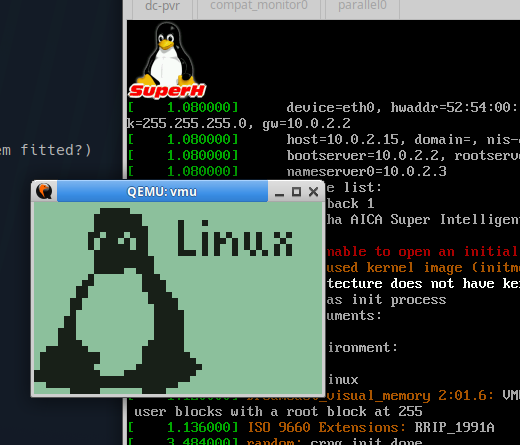

# Boot Dreamcast Linux with QEMU

Boots the images of [Modern Linux on the Dreamcast](https://github.com/foxdrodd/dreamcast-linux) with qemu.
And does nightly integration against mainline linux-next, with 2 known or [soon to be upstreamed patches](https://github.com/foxdrodd/qemu/tree/dreamcast/tests/dreamcast).

## Build

Only the `sh4-softmmu` target is needed. From the source root:

```
./configure --target-list=sh4-softmmu --enable-slirp --disable-docs
ninja -C build qemu-system-sh4
```

`--enable-slirp` provides the user-mode network backend for the Broadband
Adapter / LAN Adapter. The binary lands at `./build/qemu-system-sh4`. After
editing sources, rebuild incrementally with `ninja -C build qemu-system-sh4`.

Build dependencies are the usual QEMU ones (a C toolchain, `ninja`, `python3`,
`glib` + `pixman` dev packages); on Debian/Ubuntu:

```
sudo apt install ninja-build python3 pkg-config libglib2.0-dev libpixman-1-dev
```

## Run

```
./build/qemu-system-sh4 \
  -M dreamcast -m 16 \
  -serial null -serial stdio \
  -kernel /home/flo/devel/t2-hacking/dreamcast/dreamcast-linux/.dreamcast/src/linux-7.1.3/vmlinux \
  -drive if=none,file=/home/flo/devel/t2-hacking/dreamcast/dreamcast-linux/build/linux-7.1.3-with-userland-musl.iso,format=raw,readonly=on
```




## Disc image formats & booting from disc

The `-drive` disc image may be either a **raw ISO9660** (`.iso`) or a
**DiscJuggler `.cdi`** (audio session + scrambled data track, as produced by
`cdi4dc`). The type is auto-detected.

Passing `-kernel` boots that kernel and uses the disc only as the root
filesystem. **Omit `-kernel`** to boot the disc itself the way a real Dreamcast
does - the emulator finds `1ST_READ.BIN` in the ISO9660 root, descrambles it,
and runs it from `0x8c010000`:

```
./build/qemu-system-sh4 -M dreamcast -m 16 -serial null -serial stdio \
  -drive if=none,file=linux-7.1.3-with-userland-musl.cdi,format=raw,readonly=on
```

# NIC Support

## LAN Adapter

```
-nic model=dc-lanadapter
```

## BBA rtl8139too

is the default selection.


# VMU (Visual Memory)

A VMU is attached as a **second `-drive if=none`** (the first is the GD-ROM). It
appears as a memory card in a controller's slot on Maple port 2 and shows up in
Linux as a 128 KB MTD device (`/dev/mtd0`, `vmu-flash` + `vmufat`).

The image must be **exactly 128 KB** and writable (raw, not `readonly`):

```
dd if=/dev/zero of=vmu.bin bs=1024 count=128
```

```
-drive if=none,file=/path/to/game.iso,format=raw,readonly=on   # GD-ROM (first)
-drive if=none,file=vmu.bin,format=raw                          # VMU (second)
```

Inside Linux the flash is at `/dev/mtd0` and can be formatted/mounted with
`vmufat`. Writes persist back to `vmu.bin` on the host.

## VMU LCD

The VMU's 48x32 monochrome LCD can be shown as a **second display** (a separate
GTK tab / SDL window). It is opt-in via the `vmu-lcd=on` machine option and
needs a VMU `-drive`:

```
-M dreamcast,vmu-lcd=on
```

The kernel registers it as `/dev/vmu_lcd0`; write exactly 192 bytes (48x32,
1bpp, MSB first) to update it, e.g. the driver draws a Tux splash on attach.
With `-display none` the LCD console can be captured over QMP/monitor with
`screendump file.ppm -d vmu` (the VMU device id is `vmu`).


# Supports

- Booting Linux with serial console
- GDROM (raw `.iso` and DiscJuggler `.cdi`; boot from disc via `1ST_READ.BIN`)
- LAN Adapter Networking
- BBA (RTL8139) Networking
- X Framebuffer
- Maple Keyboard, Mouse
- VMU (Visual Memory) as an MTD / block device
- VMU LCD as a second display (`vmu-lcd=on`)
